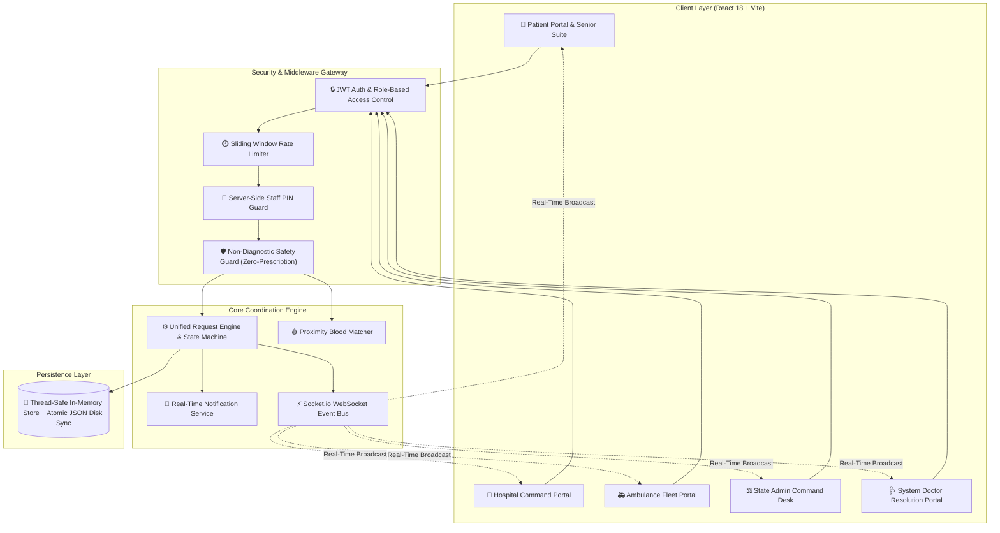
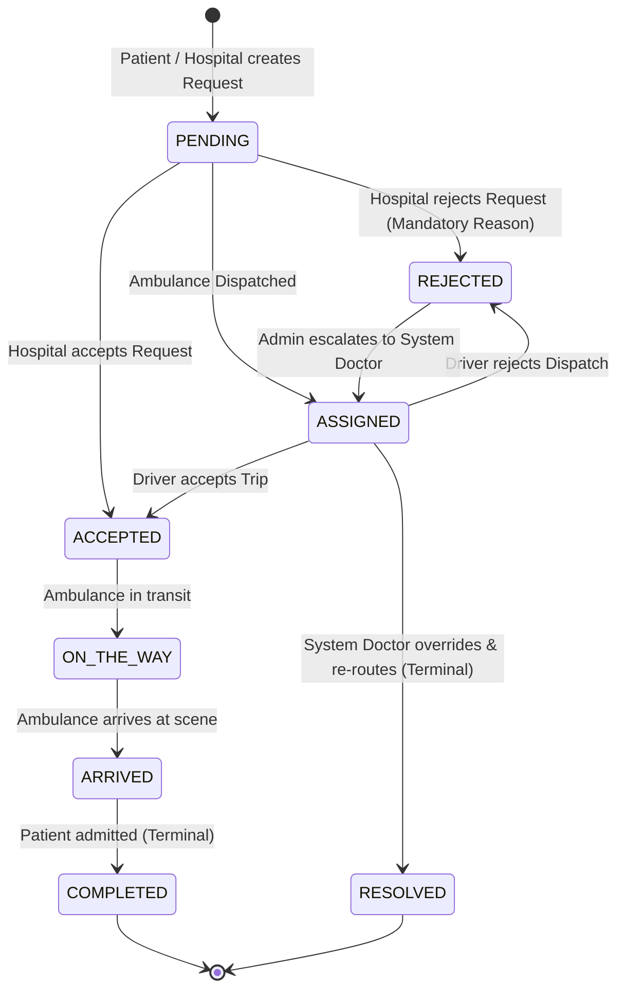

# MediLink — CARE
> *"CARE brings appointments, patients, ambulances, blood requirements, and healthcare facilities into one simple, unified coordination platform for clinics, hospitals, and patients."*

[](https://github.com/innocentgaming/FIT-FEST_2026_HACKATHON_medi)
[-success.svg)](https://github.com/innocentgaming/FIT-FEST_2026_HACKATHON_medi)
[](file:///d:/medi/Dockerfile)
[](file:///d:/medi/frontend)
[](https://github.com/innocentgaming/FIT-FEST_2026_HACKATHON_medi)
[](https://fit-fest-2026-hackathon-medi.vercel.app/)
[](https://medilink-backend-q2rh.onrender.com/health)

---

### 🌐 Live Production Deployment Links
- **🚀 Live Web Application (Frontend)**: [https://fit-fest-2026-hackathon-medi.vercel.app/](https://fit-fest-2026-hackathon-medi.vercel.app/)
- **⚡ Live REST & WebSocket Engine (Backend)**: [https://medilink-backend-q2rh.onrender.com](https://medilink-backend-q2rh.onrender.com)
- **🩺 Live System Health & Compliance Probe**: [https://medilink-backend-q2rh.onrender.com/health](https://medilink-backend-q2rh.onrender.com/health)
- **📦 GitHub Repository**: [https://github.com/innocentgaming/FIT-FEST_2026_HACKATHON_medi](https://github.com/innocentgaming/FIT-FEST_2026_HACKATHON_medi)

---

## 📑 Table of Contents
1. [Executive Summary & Problem Statement](#1-executive-summary--problem-statement)
2. [The CARE Framework & Solution Architecture](#2-the-care-framework--solution-architecture)
3. [5 Dedicated Stakeholder Portals](#3-5-dedicated-stakeholder-portals)
4. [Senior Citizen Care & Assistive Technologies](#4-senior-citizen-care--assistive-technologies)
5. [Color Grading, Aesthetics & Accessibility](#5-color-grading-aesthetics--accessibility)
6. [Request State Machine & Lifecycle Graph](#6-request-state-machine--lifecycle-graph)
7. [Comprehensive API Reference](#7-comprehensive-api-reference)
8. [Security Architecture & Regulatory Compliance](#8-security-architecture--regulatory-compliance)
9. [Automated Test Suite & Quality Assurance](#9-automated-test-suite--quality-assurance)
10. [Local Development & Quickstart](#10-local-development--quickstart)
11. [Production Deployment (Docker & Cloud Run)](#11-production-deployment-docker--cloud-run)
12. [Public Hackathon Demo Credentials](#12-public-hackathon-demo-credentials)
13. [Authors & Acknowledgements](#13-authors--acknowledgements)

---

## 1. Executive Summary & Problem Statement

### The Critical Healthcare Coordination Gap
In acute emergency scenarios and day-to-day outpatient routing, fragmented communication channels cost precious minutes. The modern healthcare landscape is burdened by five systemic friction points:

1. **Blind Hospital Admissions**: Patients in critical condition arrive at emergency rooms only to be turned away due to unannounced bed shortages or ICU saturation.
2. **Disconnected Blood Bank Cold Storage**: Locating rare compatible blood units requires frantic, manual phone calls across multiple facilities without real-time inventory verification.
3. **Unlinked Ambulance Logistics**: Emergency vehicle fleets operate in silos, lacking real-time GPS telemetry, proximity dispatch algorithms, and arrival milestone tracking.
4. **Administrative Voids (Lost Rejections)**: When a facility rejects an emergency transfer due to surge capacity, there is no automatic escalation or human-in-the-loop fallback mechanism.
5. **Elderly Digital Exclusion**: Older citizens often struggle with complex multi-step mobile workflows during panic situations or routine medical checkups.

### The Solution: MediLink CARE
**MediLink CARE** (*Coordinated Assistance & Record Engine*) is a real-time, event-driven medical coordination and emergency logistics platform developed for the **FIT-FEST Hackathon 2026**. 

Built with a **non-diagnostic, coordination-first architecture**, MediLink provides instant synchronization across all five primary stakeholders in the healthcare ecosystem through sub-millisecond WebSockets, mathematical resource clamping, strict multi-tenant Role-Based Access Control (RBAC), and automated conflict escalation desks.

```
┌─────────────────────────────────────────────────────────────────────────────────────────┐
│                                    MEDILINK CARE                                        │
│                           Healthcare Coordination Engine                                │
├──────────────────┬──────────────────┬──────────────────┬─────────────────┬──────────────┤
│ 👤 PATIENT       │ 🏥 HOSPITAL      │ 🚑 AMBULANCE     │ ⚖️ ADMIN        │ 🩺 DOCTOR    │
│ • Emergency Mode │ • Live Telemetry │ • GPS Telemetry  │ • Macro Triage  │ • Escalation │
│ • OPD Bookings   │ • Blood Bank     │ • Trip Lifecycle │ • Audit Trails  │ • Re-Routing │
│ • Blood Matcher  │ • Bed Allocation │ • Duty Switcher  │ • Demo Reset    │ • Resolution │
│ • Senior Suite   │ • Staff PIN Lock │ • Milestone Step │ • Filter Engine │ • Overrides  │
└──────────────────┴──────────────────┴──────────────────┴─────────────────┴──────────────┘
```

---

## 2. The CARE Framework & Solution Architecture

MediLink is structured around four foundational pillars (**C.A.R.E.**):

- **C — Coordinated Emergency Dispatch**: Proximity-based calculation of available ambulances with simulated GPS radar and milestone tracking (`DISPATCHED` $\to$ `ON_THE_WAY` $\to$ `ARRIVED` $\to$ `COMPLETED`).
- **A — Administrative Resource Synchronization**: Sub-millisecond broadcast of verified general bed, ICU, ventilator, oxygen, and blood inventories with mathematical non-negative clamping ($\ge 0$).
- **R — Real-Time Stakeholder Communication**: Bidirectional Socket.io event bus keeping patients, hospital ward supervisors, drivers, and coordinators aligned without manual refreshes.
- **E — Escalation & Conflict Resolution**: Centralized triage desk where rejected requests are escalated to authorized System Doctors for alternative facility re-routing and terminal resolution.

### System Architecture Diagram



---

## 3. 5 Dedicated Stakeholder Portals

### 👤 1. Patient Portal
- **🚨 1-Click Emergency Mode**: Automatically generates a tri-service requisition (ICU Bed + Blood Group + Priority Ambulance) with priority locking, live incident timeline, and automatic family SMS/call notification.
- **📅 OPD Clinic Appointments**: Administrative appointment booking with date-validation, specialist selection, and duplicate slot prevention.
- **🩸 Proximity Blood Requirement Matcher**: Queries 8 blood groups against live cold storage stock with distance-sorted hospital matches and instant emergency dispatch.
- **🚑 Live Radar Map**: Real-time Leaflet map tracking approaching ambulances with animated radar pings.
- **🔔 Live Notifications**: Instant audio-visual alerts when an appointment or ambulance trip updates.

### 🏥 2. Hospital & Clinic Management Portal
- **📊 Real-Time Resource Telemetry**: Direct control over available general beds, ICU units, ventilators, and oxygen cylinders with live mathematical clamping.
- **🩸 Cold Storage Blood Inventory**: Real-time stock counters across all 8 blood groups (`A+`, `A-`, `B+`, `B-`, `AB+`, `AB-`, `O+`, `O-`).
- **🔒 Server-Side Staff Security PIN Safeguard**: Environment-configurable PIN verification (`DEMO_INVENTORY_PIN`) with constant-time comparison protecting live inventory updates.
- **📥 Admission & Dispatch Queue**: Review incoming requests, accept admissions, or reject with mandatory audit reasons (`responseNotes`).
- **👨‍⚕️ Specialist Roster**: View available on-duty doctors and department specialists.

### 🚑 3. Ambulance Driver Fleet Portal
- **🟢 Duty Switcher**: One-click toggling between `AVAILABLE`, `ON_DUTY`, and `OFFLINE`.
- **📍 Live GPS Telemetry Stream**: Continuous simulation of vehicle coordinates updating both driver and patient maps.
- **🚀 Step-by-Step Milestone Progression**: Advance trip lifecycle with state-checked transitions:
  - `Accept Request` $\to$ `On the Way` $\to$ `Arrived at Patient` $\to$ `Trip Completed`.
- **❌ Rejection with Reason**: Allows drivers to decline with mandatory operational reasons (e.g., mechanical fault or traffic block) triggering auto-reassignment.

### ⚖️ 4. State Command Admin Portal
- **🌐 Macro Surveillance**: Network-wide overview of total hospitals, active fleet, bed occupancy, and unresolved queues.
- **🚨 Conflicts & Triage Escalation Desk**: Dedicated view listing all rejected emergency requests, displaying rejection notes, and providing 1-click assignment to System Doctors.
- **📁 All Network Requests Archive**: Full searchable archive with multi-variable filters (Status, Priority, Type, Hospital, Date).
- **🛡️ Immutable Audit Log Stream**: Complete log of all administrative actions, timestamps, and resource mutations.
- **🔄 1-Click System State Reset**: Resets catalog back to baseline for seamless live jury demonstrations.

### 🩺 5. System Doctor Portal
- **⚡ Rejection Override Authority**: Administrative mandate to review rejected hospital cases and evaluate alternative destination facilities.
- **📋 Triage Caseload**: Dedicated queue of assigned conflict cases with full patient history and triage context.
- **✅ Terminal Resolution**: Re-routes patient to a verified alternative facility and transitions the request to immutable `RESOLVED` status.

---

## 4. Senior Citizen Care & Assistive Technologies

MediLink features a dedicated **Elderly Care & Assistive Suite** tailored for senior citizens, individuals with visual/motor challenges, and non-tech-savvy users:

```
┌─────────────────────────────────────────────────────────────────────────────┐
│                    👴 SENIOR CITIZEN ACCESSIBILITY SUITE                     │
├─────────────────────────────────────────────────────────────────────────────┤
│  [📞 108 Ambulance]      [🛡️ 14567 Elder Line]     [🚨 112 National SOS]    │
│  [🩺 1075 Tele-Doctor]   [👤 Call Son / Daughter]   [🔊 Voice Readout]      │
│  [🚨 2-Step SOS Rescue]  [💊 Daily Medicine Check]  [💓 Live Vital Watch]   │
└─────────────────────────────────────────────────────────────────────────────┘
```

1. **⚡ 1-Tap Speed Dial for National Emergency Lines**: Direct browser `tel:` and simulated dispatch triggers for:
   - `108` (National Ambulance Service)
   - `14567` (National Elder Line Helpline)
   - `112` (All-in-One National Emergency)
   - `1075` (National Health & Tele-Doctor Helpline)
2. **🎵 DTMF Audio Tone Dialpad & Speech Narration**: Web Audio API generates authentic dual-tone multi-frequency phone keypad tones with Web Speech API voice readout for each digit pressed.
3. **🛡️ 2-Step Confirmation Family Alert Modal**: Prevents accidental button presses by requiring a clear 2-step confirmation with a live 5-second cancel countdown before transmitting SMS/Call alerts to family caregivers.
4. **🚨 Automatic Family Notification in Emergency Mode**: When Emergency Mode is engaged, configured family emergency contacts (`Dad/Mom/Caregiver`) receive instant notification with patient coordinates and target hospital name.
5. **💊 Daily Medicine & Vital Tracker**: High-contrast, large-font checklist allowing elderly patients to log daily tablets and track resting pulse.

---

## 5. Color Grading, Aesthetics & Accessibility

MediLink CARE is styled using an ultra-modern, high-fidelity design system engineered in [index.css](file:///d:/medi/frontend/src/styles/index.css):

- **🎨 Ambient Mesh Dark Mode**: Fixed radial ambient lighting meshes (`rgba(2, 132, 199, 0.08)`, `rgba(99, 102, 241, 0.07)`, `rgba(16, 185, 129, 0.05)`) provide an ultra-clean canvas.
- **✨ Glassmorphic Elevation**: Cards feature `backdrop-filter: blur(16px)` with delicate border glows and smooth `translateY(-3px)` hover animations.
- **💡 Luminous Breathing Status Dots**: Distinctive status badges with glowing pulsation dots for `PENDING`, `ASSIGNED`, `ACCEPTED`, `COMPLETED`, `REJECTED`, and `RESOLVED`.
- **♿ Accessibility Toolbar (WCAG 2.2 AA)**:
  - Font Size Scaling (Normal / Large / Extra-Large)
  - Color Theme Switcher (**Deep Slate**, **OLED Midnight**, **Clinical Light Mode**)
  - Contrast Inversion & Text-to-Speech screen reader assistance.
- **🗺️ Zero-API Leaflet Maps**: High-performance OpenStreetMap tiles with custom animated vehicle radar markers and zero paid API dependencies.

---

## 6. Request State Machine & Lifecycle Graph

MediLink enforces deterministic, single-source-of-truth state transitions in [`backend/src/engine/requestEngine.js`](file:///d:/medi/backend/src/engine/requestEngine.js):



---

## 7. Comprehensive API Reference

### 🔐 Authentication & Session Endpoints
| Method | Endpoint | Description | Auth Required |
| :--- | :--- | :--- | :--- |
| `POST` | `/api/login` | Authenticate user (Email or Phone) and receive signed JWT. | None |
| `POST` | `/api/patient/register` | Register a new citizen patient record. | None |
| `POST` | `/api/hospital/register` | Register a new hospital facility. | None |
| `POST` | `/api/ambulance/register` | Register a new ambulance unit and driver account. | None |
| `GET` | `/api/patient/profile` | Retrieve authenticated patient record with medical history. | `Bearer JWT` |

### 🏥 Hospital & Telemetry Endpoints
| Method | Endpoint | Description | Auth Required |
| :--- | :--- | :--- | :--- |
| `GET` | `/api/hospitals` | List all hospitals with live capacity, blood stock, and coordinates. | Public |
| `GET` | `/api/hospital/:id` | Fetch specific hospital metadata and doctor specialist roster. | Public |
| `PUT` | `/api/hospital/:id/resources` | Update bed, ICU, ventilator, and oxygen counters *(Protected by PIN)*. | Hospital Admin |
| `PUT` | `/api/hospital/:id/bloodbank` | Update 8-group cold storage blood units *(Protected by PIN)*. | Hospital Admin |

### 📅 OPD Clinic Appointments
| Method | Endpoint | Description | Auth Required |
| :--- | :--- | :--- | :--- |
| `GET` | `/api/appointments` | List appointments for patient or hospital queue. | `Bearer JWT` |
| `POST` | `/api/appointments` | Book an OPD slot *(Blocks duplicate slots and past dates)*. | Patient |
| `PUT` | `/api/appointments/:id/status` | Advance appointment lifecycle (`CONFIRMED`, `COMPLETED`, `CANCELLED`). | Hospital / Patient |

### 🚨 Unified Requests & Emergency Engine
| Method | Endpoint | Description | Auth Required |
| :--- | :--- | :--- | :--- |
| `GET` | `/api/requests` | List requests filtered by user role and facility. | `Bearer JWT` |
| `POST` | `/api/requests` | Create emergency admission, ambulance, blood, or equipment requisition. | Patient / Hospital |
| `POST` | `/api/requests/search-blood` | Proximity-sorted smart blood requirement query engine. | Public / Patient |
| `PUT` | `/api/requests/:id/status` | Execute state machine transition with mandatory rejection notes. | Authorized Role |

### 🚑 Ambulance Fleet & GPS Telemetry
| Method | Endpoint | Description | Auth Required |
| :--- | :--- | :--- | :--- |
| `GET` | `/api/ambulance` | List all ambulances, equipment types, and duty status. | Public |
| `PUT` | `/api/ambulance/:id/status` | Update driver duty state (`AVAILABLE`, `ON_DUTY`, `OFFLINE`). | Driver |
| `PUT` | `/api/ambulance/:id/location` | Stream high-precision GPS coordinate telemetry. | Driver |

### ⚖️ State Admin Command & System Doctor Escalation
| Method | Endpoint | Description | Auth Required |
| :--- | :--- | :--- | :--- |
| `GET` | `/api/admin/patient-requests` | Macro request feed with summary counts and unresolved queue. | Admin |
| `POST` | `/api/admin/requests/:requestId/assign` | Escalate rejected emergency request to a System Doctor. | Admin |
| `GET` | `/api/admin/audit-logs` | Retrieve immutable administrative audit log stream. | Admin |
| `POST` | `/api/admin/reset-demo` | Reset database state back to clean baseline catalog. | Admin |
| `GET` | `/api/doctor/requests` | System Doctor isolated triage queue of escalated cases. | System Doctor |
| `PUT` | `/api/doctor/requests/:requestId/resolve` | Override rejection, re-route to alternative facility, and resolve. | System Doctor |

---

## 8. Security Architecture & Regulatory Compliance

### 🛡️ Non-Diagnostic Safety Guard
MediLink CARE strictly enforces regulatory non-diagnostic boundaries via [`backend/src/middleware/safety.js`](file:///d:/medi/backend/src/middleware/safety.js):
- Intercepts and rejects requests containing diagnostic terms or drug prescriptions.
- Returns explicit regulatory disclaimers stating that clinical diagnosis remains exclusively between licensed healthcare practitioners and patients.

### 🔒 Multi-Tenant RBAC & Staff PIN Guard
- **Cryptographic JWTs**: Stateless authentication tokens signed with HS256.
- **Bcrypt Hashing**: 10 salted rounds protecting all user passwords.
- **Constant-Time PIN Verification**: Hospital resource updates require a secure server-side staff PIN (`DEMO_INVENTORY_PIN`) verified with `crypto.timingSafeEqual`.
- **Sliding Window Rate Limiter**: Protects authentication and emergency dispatch endpoints against automated brute-force attacks.

---

## 9. Automated Test Suite & Quality Assurance

MediLink CARE features comprehensive automated test coverage (**279 tests across 10 test suites, 100% Passing**):

```bash
# Run all automated tests
cd backend
npm run test:all
```

### Test Suite Breakdown:
1. `test/api.test.js` (18 Tests) — Healthcheck probes, non-diagnostic filter, baseline API.
2. `test/auth-rbac.test.js` (24 Tests) — Password hashing, JWT lifecycle, RBAC boundary enforcement.
3. `test/appointments.test.js` (14 Tests) — Past date prevention, duplicate slot rejection, confirmation flow.
4. `test/hospital-resources-blood.test.js` (22 Tests) — Telemetry clamping ($\ge 0$), cold storage matrix, smart blood search.
5. `test/ambulance-tracking.test.js` (22 Tests) — Proximity dispatch, GPS telemetry streaming, driver authorization.
6. `test/emergency-mode.test.js` (16 Tests) — 1-click tri-service trigger, live incident timeline, priority lock.
7. `test/escalation.test.js` (43 Tests) — Admin triage queue, System Doctor conflict resolution, audit logs.
8. `test/unified-request-engine.test.js` (46 Tests) — State machine transition graph, mandatory rejection reasons.
9. `test/qa-e2e-audit.test.js` (53 Tests) — 5-stakeholder end-to-end integration walkthrough and security audits.
10. `test/senior-accessibility.test.js` (21 Tests) — Emergency phone dialers, DTMF key tones, and family alerts.

---

## 10. Local Development & Quickstart

### Prerequisites
- **Node.js**: `v18.0.0` or `v20.0.0+`
- **npm**: `v9.0.0+`

### 1. Clone & Install Dependencies
```bash
git clone https://github.com/innocentgaming/FIT-FEST_2026_HACKATHON_medi.git
cd FIT-FEST_2026_HACKATHON_medi

# Install backend dependencies
cd backend
npm install

# Install frontend dependencies
cd ../frontend
npm install
```

### 2. Environment Configuration
Create a `.env` file in the `backend` directory (optional, defaults provided):
```env
PORT=5000
NODE_ENV=development
JWT_SECRET=medilink_hackathon_super_secret_key_2026
DEMO_INVENTORY_PIN=1234
CLIENT_URL=http://localhost:3000
```

### 3. Start Development Servers
```bash
# Terminal 1: Backend API & WebSocket Server (Port 5000)
cd backend
npm run dev

# Terminal 2: Frontend Vite Development Server (Port 3000)
cd frontend
npm run dev
```

Open your browser at **`http://localhost:3000`**.

---

## 11. Production Deployment (Docker & Cloud Run)

### Multi-Stage Docker Container Build:
```bash
# Build production container image
docker build -t medilink-care .

# Run container locally
docker run -p 8080:8080 -e PORT=8080 -e NODE_ENV=production medilink-care
```

### Google Cloud Run 1-Click Deployment:
```bash
# Submit build to Google Artifact Registry / Cloud Build
gcloud builds submit --tag gcr.io/YOUR_GCP_PROJECT/medilink-care

# Deploy managed Cloud Run service
gcloud run deploy medilink-care \
  --image gcr.io/YOUR_GCP_PROJECT/medilink-care \
  --platform managed \
  --region asia-south1 \
  --allow-unauthenticated \
  --port 8080 \
  --set-env-vars="NODE_ENV=production,PORT=8080,JWT_SECRET=production_secret_key"
```

---

## 12. Public Hackathon Demo Credentials

> **NOTICE**: *The credentials below are public test accounts provided exclusively for jury evaluation and verification.*

| Role | Email / Username | Mobile Number | Password | Quick Switch Action |
| :--- | :--- | :--- | :--- | :--- |
| **👤 Citizen Patient** | `aarav@example.com` | `9876543210` | `patient123` | Patient Portal, Emergency SOS, OPD Bookings |
| **🏥 Hospital Admin** | `rubyhall@medilink.org` | `9822011111` | `hospital123` | Capacity Telemetry, Blood Bank, Admissions |
| **🚑 Ambulance Driver**| `driver1@medilink.org` | `9822012345` | `ambulance123` | Fleet GPS, Milestone Progress, Trip Accept |
| **⚖️ State Command Admin** | `admin@medilink.gov.in`| `9800000000` | `admin123` | Macro Surveillance, Triage Desk, Audit Logs |
| **🩺 System Doctor** | `dr.joshi@medilink.gov.in`| `9811111111` | `doctor123` | Conflict Resolution, Override Re-routing |

---

## 13. Authors & Acknowledgements

- **Lead Developer**: **Aditya Yadav** ([@innocentgaming](https://github.com/innocentgaming))
- **Hackathon**: **FIT-FEST Hackathon 2026** — *Open Healthcare Innovation Track*
- **Technology Stack**: React 18, Vite, Node.js, Express, Socket.io, Leaflet, Lucide Icons, Docker.

---
*MediLink CARE — Ensuring zero lost medical emergencies through real-time coordination.*
