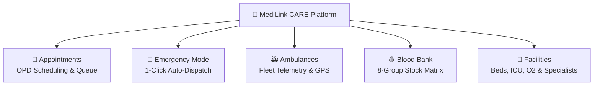
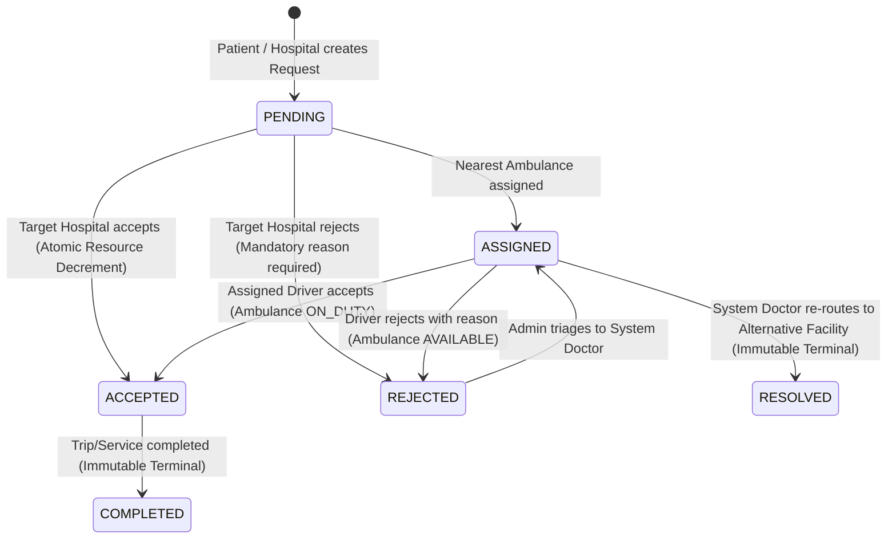

# 🏥 MediLink – CARE (Coordinated Assistance & Record Engine)
> **FIT-FEST 2026 Hackathon MVP** | Unified Healthcare Coordination, Emergency Dispatch & Administrative Platform

[](https://github.com/innocentgaming/FIT-FEST_2026_HACKATHON_medi)
[](https://github.com/innocentgaming/FIT-FEST_2026_HACKATHON_medi)
[](file:///d:/medi/Dockerfile)
[](file:///d:/medi/frontend)

---

## 🛡️ Critical Safety & Non-Diagnostic Scope Notice

> **IMPORTANT REGULATORY & SAFETY DISCLAIMER:**  
> **"MediLink provides administrative and emergency coordination functionality. It does NOT provide medical diagnosis, treatment recommendations, or clinical decision-making."**

MediLink CARE is strictly a **healthcare coordination, logistics, and administrative management engine**:
- ❌ **Explicitly Prohibited**: Clinical diagnosis, disease prediction, automated triage scoring, treatment suggestions, drug dosage prescriptions.
- ✅ **Explicitly Supported**: Administrative OPD appointments, live bed/ICU/ventilator/oxygen telemetry, 8-group blood bank stock synchronization, 1-click emergency ambulance dispatch with live simulated GPS tracking, conflict escalation triage to System Doctors, and multi-channel real-time notifications.

---

## 🌟 10-Second Judge Clarity: The 5 Operational Pillars

MediLink CARE organizes complex regional healthcare networks into 5 clear operational pillars:



---

## 👥 5 Stakeholder Roles & Seed Credentials

The application provides pre-seeded accounts and a 1-click Quick Role Switcher in the top navigation bar:

| Role | Email / Phone | Password | Primary Scope & Access |
| :--- | :--- | :--- | :--- |
| **👤 PATIENT** | `aarav@example.com` or `9876543210` | `patient123` | Emergency Mode, OPD appointments, Find Hospitals/ICU, Smart Blood Matcher, Request & Track Ambulances |
| **🏥 HOSPITAL ADMIN** | `rubyhall@medilink.org` | `hospital123` | Manage live Beds, ICU, Ventilators, Oxygen & Blood stock, process admissions, assign ambulances |
| **🚑 AMBULANCE DRIVER** | `driver1@medilink.org` or `9822012345` | `ambulance123` | Availability toggles (`AVAILABLE`, `ON_DUTY`, `OFFLINE`), dispatch acceptance, live simulated GPS stream |
| **⚖️ COMMAND ADMIN** | `admin@medilink.gov.in` | `admin123` | Macro surveillance metrics, monitor network queues, triage rejected emergencies to System Doctors |
| **🩺 SYSTEM DOCTOR** | `dr.joshi@medilink.gov.in` | `doctor123` | Isolated conflict queue, clinical resource re-routing to alternative facilities, resolution closure |

---

## 🔄 Centralized Request Engine & State Lifecycle

All patient admissions, hospital transfers, blood requisitions, equipment requests, and ambulance dispatches are governed by a centralized, atomic state machine:



---

## 🚀 Quick Start & Local Development

### Prerequisites
- **Node.js**: v18.0.0 or higher
- **npm**: v9.0.0 or higher
- **Docker**: (Optional, for containerized run)

### 1. Clone & Install Dependencies
```bash
# Clone the repository
git clone https://github.com/innocentgaming/FIT-FEST_2026_HACKATHON_medi.git
cd FIT-FEST_2026_HACKATHON_medi

# Install Backend dependencies
cd backend
npm install

# Install Frontend dependencies
cd ../frontend
npm install
```

### 2. Run Local Development Servers
In Terminal 1 (Backend API + Real-time Socket Bus):
```bash
cd backend
npm run dev
# Running on http://localhost:5000 (0.0.0.0)
```

In Terminal 2 (Vite Frontend SPA):
```bash
cd frontend
npm run dev
# Running on http://localhost:3000
```

---

## 🧪 Comprehensive Automated Test Suites

Execute all 9 test suites covering 258 automated test assertions:

```bash
cd backend
npm run test:all
```

### Test Suite Breakdown:
1. `test/api.test.js`: Core health, safety guard, login, and resource basics.
2. `test/auth-rbac.test.js`: JWT token verification, RBAC permissions, and multi-tenant isolation.
3. `test/appointments.test.js`: OPD booking, duplicate slot prevention, past-date guards, and patient search.
4. `test/hospital-resources-blood.test.js`: Live resource telemetry, 8-group blood stock, clamping, and atomic decrements.
5. `test/ambulance-tracking.test.js`: Fleet status toggles, nearest-unit auto-dispatch, simulated GPS telemetry, and driver RBAC.
6. `test/emergency-mode.test.js`: 4 emergency actions, multi-resource filters, and 7-step visual timeline stepper.
7. `test/escalation.test.js`: Macro admin metrics, rejection triage queue, System Doctor isolation, and resolution re-routing.
8. `test/unified-request-engine.test.js`: Centralized state validator, notification service, Socket.io event bus, and privacy sanitization.
9. `test/qa-e2e-audit.test.js`: Complete 5-stakeholder multi-role end-to-end scenario + security penetration audit.

---

## 🐳 Production Deployment & Google Cloud Run

### 1. Build and Run via Docker Locally
```bash
# Build multi-stage container (Vite Frontend + Express Backend)
docker build -t medilink-care .

# Run container on port 8080
docker run -p 8080:8080 -e PORT=8080 medilink-care
```

### 2. Deploy to Google Cloud Run
```bash
# 1. Authenticate with Google Cloud
gcloud auth login
gcloud config set project YOUR_GCP_PROJECT_ID

# 2. Build image with Google Cloud Build
gcloud builds submit --tag gcr.io/YOUR_GCP_PROJECT_ID/medilink-care

# 3. Deploy to Cloud Run (Managed, HTTPS, Public Entry)
gcloud run deploy medilink-care \
  --image gcr.io/YOUR_GCP_PROJECT_ID/medilink-care \
  --platform managed \
  --region us-central1 \
  --allow-unauthenticated \
  --port 8080 \
  --set-env-vars="NODE_ENV=production,PORT=8080,JWT_SECRET=production_strong_secret_key_2026"
```

---

## ⚙️ Environment Variables Reference

| Variable | Default | Description |
| :--- | :--- | :--- |
| `PORT` | `8080` (Cloud Run) / `5000` | Port for Express & Socket.io server (listens on `0.0.0.0`) |
| `NODE_ENV` | `development` / `production` | Environment mode |
| `JWT_SECRET` | `medilink_care_hackathon_secret_2026` | Secret key used to sign and verify JSON Web Tokens |
| `VITE_API_URL` | `/api` | Base URL for REST API endpoints |
| `VITE_SOCKET_URL` | Same-origin | Base URL for Socket.io WebSocket connection |

---

## ♿ WCAG 2.1 AA Accessibility Features
- **No Color-Alone Statuses**: All status badges embed high-contrast text and distinct Lucide SVG icons (`role="status"`).
- **Comprehensive States**: Loading skeletons, Empty state cards with actionable CTAs, and Error states with safe retry triggers.
- **Focus Indicators**: Visible focus rings (`focus:ring-2 focus:ring-emerald-500`) on all interactive buttons, inputs, and tabs.
- **Screen Reader Compatibility**: Semantic HTML5 elements (`<header>`, `<main>`, `<section>`, `<article>`, `<dialog>`) and explicit ARIA live regions.

---

## 📄 License & Hackathon Attribution
Built for the **FIT-FEST 2026 Hackathon**. Open-sourced under the MIT License.
