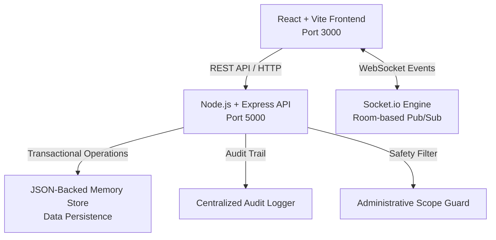
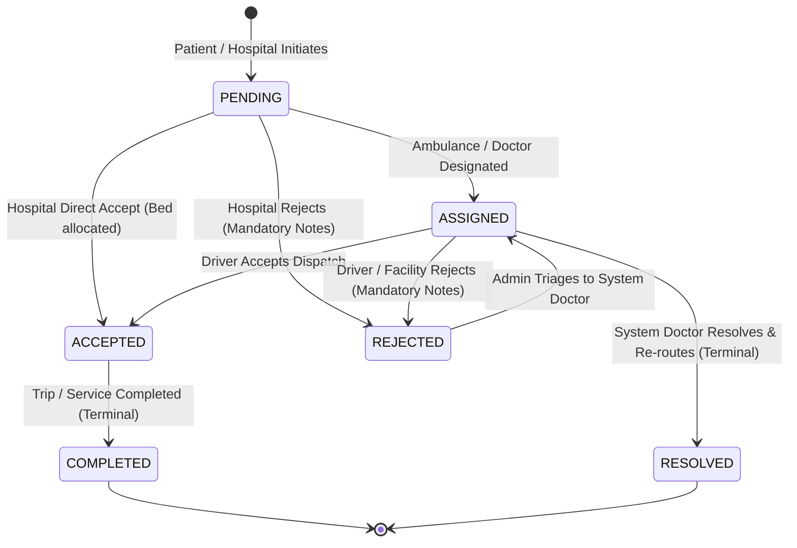
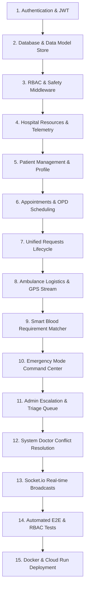

# MediLink CARE — Technical Architecture Document

## 1. System Overview
MediLink CARE (Coordinated Assistance & Record Engine) is an administrative and healthcare coordination platform engineered for the FIT FEST 2026 Hackathon. It provides a real-time event-driven infrastructure connecting Patients, Hospitals/Clinics, Ambulance Drivers, Command Admins, and System Doctors.

---

## 2. Technology Stack
- **Backend**: Node.js, Express, Socket.io, JSON/File-persisted transactional store, JWT, Bcrypt.js, UUID, CORS, Dotenv.
- **Frontend**: React 18, Vite 6, Leaflet (interactive maps & GPS telemetry), Lucide React (accessible icons), Custom Vanilla CSS Glassmorphism Design System (WCAG 2.2 AA compliant).
- **Testing**: Node.js native test runner with end-to-end integration and RBAC test suite.
- **Real-Time Communication**: Socket.io bidirectional rooms (`role_ADMIN`, `hospital_{id}`, `ambulance_{id}`, `user_{id}`).

---

## 3. Five User Roles & RBAC Matrix

| Capability / Resource | Patient | Hospital | Ambulance | Admin | System Doctor |
| :--- | :---: | :---: | :---: | :---: | :---: |
| Authenticate / Register | ✅ | ✅ | ✅ | ✅ (Seeded) | ✅ (Seeded) |
| Emergency Mode Dispatch | ✅ | ✅ | ❌ | ✅ | ❌ |
| Book / Cancel Appointments | ✅ | ✅ | ❌ | ✅ | ❌ |
| Confirm / Mark No-Show Appointments | ❌ | ✅ | ❌ | ✅ | ❌ |
| Update Hospital Live Resources | ❌ | ✅ (Own) | ❌ | ✅ | ✅ |
| Update Blood Bank Stock | ❌ | ✅ (Own) | ❌ | ✅ | ❌ |
| Query Smart Blood Stock | ✅ | ✅ | ✅ | ✅ | ✅ |
| Progress Ambulance Dispatch Trip | ❌ | ❌ | ✅ (Assigned) | ✅ | ❌ |
| Stream Simulated GPS Telemetry | ❌ | ❌ | ✅ (Assigned) | ✅ | ❌ |
| Reject Request (with Notes) | ❌ | ✅ | ✅ | ✅ | ❌ |
| Escalate Rejected Request to Doctor | ❌ | ❌ | ❌ | ✅ | ❌ |
| Resolve Conflict & Re-Route Facility | ❌ | ❌ | ❌ | ✅ | ✅ |
| View System-Wide Audit Logs | ❌ | ❌ | ❌ | ✅ | ❌ |

---

## 4. Request Status State Machine

### Business Rules Enforced:
1. **Mandatory Rejection Notes**: Any transition to `REJECTED` strictly requires `responseNotes`.
2. **Driver Assignment Lock**: Only the assigned ambulance driver or admin can transition an ambulance request to `ACCEPTED`.
3. **Doctor Resolution Lock**: Only the designated `System Doctor` or admin can transition an escalated conflict to `RESOLVED`.
4. **Transactional Bed Decrement**: Transitioning an admission request to `ACCEPTED` automatically decrements available beds in hospital resources.
5. **Immutable Terminal States**: `COMPLETED` and `RESOLVED` cannot be transitioned to any other state.

---

## 5. Implementation Dependency Graph

---

## 6. Safety & Administrative Scope Guardrails
MediLink CARE is strictly non-diagnostic. The following architecture guarantees compliance:
- **Middleware Guard** (`backend/src/middleware/safety.js`): Intercepts all write requests and rejects any clinical terms (`prescription`, `diagnosis`, `dosage`, `cure`) with HTTP 400.
- **UI Safety Banner** (`frontend/src/components/SafetyBanner.jsx`): Persistent notice that MediLink is an administrative coordination tool.
- **Appointment Scoping**: Purpose field is limited to administrative text (e.g. "Routine OPD Consultation Desk").
