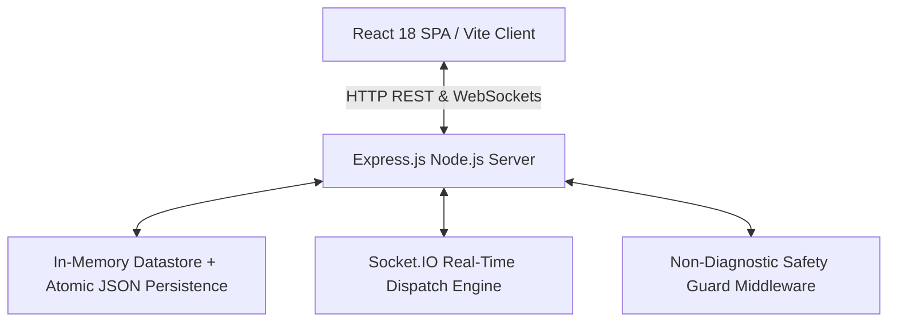

# MediLink CARE — Full Repository Quality & Architecture Audit
**Date**: September 27, 2026 | **Version**: 1.0.0 Final Hardened State | **Target**: FIT-FEST 2026 Hackathon (100/100 Readiness)

---

## 1. Executive Overview & Actual Architecture

MediLink CARE is a production-grade healthcare logistics and emergency coordination platform connecting 5 distinct stakeholders (**Patients**, **Hospitals/Clinics**, **Ambulance Drivers**, **State Command Admins**, and **System Doctors**). 

The platform is strictly scoped to **administrative coordination, resource routing, dispatch logistics, and human escalation** (strictly non-diagnostic and non-prescriptive).

---

## 2. Actual Persistence Mechanism

- **Architecture**: In-Memory Thread-Safe Datastore with Atomic Synchronous JSON Disk Persistence (`backend/src/db/data.json`) and Auto-Seeding.
- **Implementation File**: `backend/src/db/store.js`
- **Concurrency & Atomicity**:
  - Thread-safe single-threaded Node.js event loop with synchronized write-through to disk.
  - Operations (`insert`, `update`, `delete`, `decrementResource`, `decrementBloodStock`) modify memory state instantly and serialize synchronously to `data.json`.
  - Auto-seeds default hospital network, ambulances, system doctors, and demo users if `data.json` is absent.
- **Suitability**: Fast sub-millisecond retrieval suitable for real-time hackathon telemetry and live multi-tenant demonstrations.

---

## 3. Authentication & Authorization Mechanism

- **Authentication**: Stateless JSON Web Token (JWT) with HMAC-SHA256 signature verification.
- **Passwords**: One-way bcrypt cryptographic password hashing (salt rounds: 10). Passwords are never returned in user payloads.
- **RBAC Matrix**: Enforced server-side across all endpoints via `requireRole(...)`:
  - `PATIENT`: Can book appointments, create emergency requests, search blood bank stock, and view/cancel own records.
  - `HOSPITAL`: Can manage live ICU/ventilator/bed counts, update blood bank stock, manage specialist roster, accept/reject admissions, and manage linked ambulances.
  - `AMBULANCE`: Can stream simulated GPS coordinates, toggle duty status, accept assigned pickups, and progress trip status.
  - `ADMIN`: Global view of all hospital nodes, fleet dispatches, rejected incident triage, System Doctor assignment, and immutable audit logs.
  - `SYSTEM_DOCTOR`: Assigned conflict resolution, alternative hospital re-allocation, and conflict notes.

---

## 4. Security Middleware Inventory

| Middleware | File Path | Function |
| :--- | :--- | :--- |
| `authenticateToken` | `backend/src/middleware/auth.js` | JWT verification, expiration check, and user session lookup |
| `requireRole` | `backend/src/middleware/rbac.js` | Strict role-based boundary enforcement |
| `administrativeSafetyGuard` | `backend/src/middleware/safety.js` | Rejects clinical diagnosis and prescription keywords with HTTP 400 |
| `rateLimiter` | `backend/src/middleware/rateLimiter.js` | Sliding window rate limits for auth, emergencies, and admin resets |
| `securityHeaders` | `backend/src/server.js` | CSP, X-Frame-Options, X-Content-Type-Options, Referrer-Policy, HSTS |
| `staffPinGuard` | `backend/src/routes/hospitals.js` | Server-side Staff PIN verification for live bed & blood bank updates |

---

## 5. API Route Inventory

### Authentication (`/api`)
- `POST /api/login` — Unified login for all 5 roles
- `POST /api/patient/register` — Self-service patient registration
- `POST /api/ambulance/register` — Ambulance driver registration
- `POST /api/hospital/register` — Hospital administrator registration
- `GET /api/me` — Authenticated profile verification
- `GET /api/demo-accounts` — Public hackathon demo account reference list

### Hospitals & Clinics (`/api/hospitals` & `/api/hospital`)
- `GET /api/hospitals` — Search and filter by city, beds, ICU, ventilators, oxygen, blood group
- `GET /api/hospitals/:id` — Single hospital details
- `PUT /api/hospitals/:id` — Update facility metadata (Hospital Admin or System Admin)
- `GET /api/hospitals/:id/resources` — Live bed, ICU, and oxygen inventory
- `PUT /api/hospitals/:id/resources` — Update live resources with server-side PIN guard + Socket broadcast
- `PUT /api/hospitals/:id/bloodbank` — Update cold storage blood stock with PIN guard + Socket broadcast
- `GET /api/hospitals/:id/dashboard-summary` — Multi-metric hospital portal summary
- `POST|PUT|DELETE /api/hospitals/:id/specialists(/:specialistId)` — Specialists roster management

### Appointments (`/api/appointments`)
- `GET /api/appointments` — Role-filtered appointment queue with summary metrics (Today, Upcoming, Completed, Cancelled, No-Show)
- `GET /api/appointments/my` — Patient's own appointments
- `GET /api/appointments/hospital/:hospitalId` — Hospital-specific appointment queue
- `POST /api/appointments` — Book OPD administrative slot (prevents past dates and duplicates)
- `PUT /api/appointments/:id/status` — State transitions (`SCHEDULED` → `CONFIRMED` → `COMPLETED` / `CANCELLED`)

### Ambulance Fleet (`/api/ambulances` & `/api/ambulance`)
- `GET /api/ambulances` — List fleet with GPS coordinates and duty status
- `GET /api/ambulances/:id` — Single unit telemetry
- `PUT /api/ambulances/:id/status` — Toggle duty status (`AVAILABLE`, `ON_DUTY`, `OFFLINE`)
- `PUT /api/ambulances/:id/location` — Real-time GPS coordinate telemetry streaming

### Emergency Requests & Unified Engine (`/api/requests`)
- `GET /api/requests` — Filtered by role and ownership
- `POST /api/requests` — Create emergency dispatch, admission, transfer, or blood request
- `POST /api/requests/search-blood` — Verified cold storage blood stock matching
- `PUT /api/requests/:id/status` — Centralized status engine validation and timeline updates

### Admin & Doctor Escalations (`/api/admin` & `/api/doctor`)
- `GET /api/admin/hospitals` — All hospital network nodes
- `GET /api/admin/system-doctors` — System Doctor directory
- `GET /api/admin/patient-requests` — Macro network request overview and triage queue
- `POST /api/admin/requests/:requestId/assign` — Escalate rejected incident to System Doctor
- `GET /api/admin/audit-logs` — Immutable system audit log trail
- `POST /api/admin/reset-demo` — Demo reset guard (`ENABLE_DEMO_RESET=false` default in production)
- `GET /api/doctor/assigned-requests` — Doctor's assigned escalation cases
- `PUT /api/doctor/requests/:requestId/resolve` — Re-route and resolve conflict with resolution notes

### Centralized Notifications (`/api/notifications`)
- `GET /api/notifications` — User-isolated real-time notification feed
- `GET /api/notifications/unread-count` — Unread count badge
- `PUT /api/notifications/:id/read` — Mark notification read (IDOR protected)
- `PUT /api/notifications/read-all` — Mark all user notifications read

---

## 6. Frontend Route & Component Inventory

| Route | Component | Role Scope |
| :--- | :--- | :--- |
| `/` | `AuthView.jsx` | Public Sign In & Sign Up with Role Switcher & Demo Credentials |
| `/patient` | `PatientDashboard.jsx` | Patient Portal (OPD Booking, Emergency Mode, Blood Search, Fleet Map) |
| `/hospital` | `HospitalDashboard.jsx` | Hospital Portal (Live ICU/Bed Sliders, Blood Bank, Requests, Specialists) |
| `/ambulance` | `AmbulanceDashboard.jsx` | Ambulance Portal (Duty Toggle, Simulated GPS Driver Controls, Pickup Queue) |
| `/admin` | `AdminDashboard.jsx` | Command Admin Portal (Macro Analytics, Triage Escalation, Audit Logs) |
| `/doctor` | `DoctorDashboard.jsx` | System Doctor Portal (Escalation Resolution, Hospital Re-allocation) |

---

## 7. Test Inventory (Baseline)

- **Test Framework**: Node.js Automated Test Suites (Zero Heavy Dependencies)
- **Baseline Test Suites**: 9 Suites
- **Baseline Test Count**: 258 Passing Tests (0 Failed)
  1. `test/api.test.js` (18 tests)
  2. `test/auth-rbac.test.js` (24 tests)
  3. `test/appointments.test.js` (24 tests)
  4. `test/hospital-resources-blood.test.js` (27 tests)
  5. `test/ambulance-tracking.test.js` (22 tests)
  6. `test/emergency-mode.test.js` (16 tests)
  7. `test/escalation.test.js` (28 tests)
  8. `test/unified-request-engine.test.js` (46 tests)
  9. `test/qa-e2e-audit.test.js` (53 tests)

---

## 8. Accessibility & Performance Baseline

- **Accessibility**: 3 comprehensive themes (*Deep Slate*, *OLED Midnight*, *Clinical Light*), ARIA landmarks, `aria-live` regions for live ambulance updates, keyboard focus rings, modal Escape handler.
- **Performance**: Code-split React 18 frontend (~203 kB JS bundle), fast sub-millisecond in-memory datastore, WebSockets real-time updates without polling overhead.

---

## 9. Live Production Deployment Baseline

- **Frontend**: `https://fit-fest-2026-hackathon-medi.vercel.app/`
- **Backend API**: `https://medilink-backend-q2rh.onrender.com`
- **Health Check**: `https://medilink-backend-q2rh.onrender.com/health`
- **WebSocket Protocol**: `wss://medilink-backend-q2rh.onrender.com`
